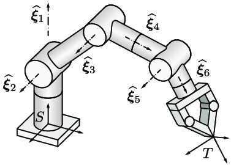

# Robot Kinematics

The main goal of this repository is mathematical calculations of forward and inverse kinematics. This is intended to be used for moving the end effector to a desired coordinate in 2D or 3D space. 

<p align="center"></img></p>

## Getting Started

These instructions will get you a copy of the project up and running on your local machine for development and testing purposes.

### Prerequisites

- Open GL (for kinematic simulation test)
- GNU Make

#### Ubuntu

```bash
sudo apt-get install freeglut3-dev libglm-dev
```

### Install

1. Compile static or shared library from source

   #### PC

   ```makefile
   clone https://github.com/staytu/robot-kinematics
   cd robot-kinematics
   make
   ```

   #### AVR

   ```makefile
   git submodule add https://github.com/staytu/robot-kinematics
   cd robot-kinematics
   make IS_AVR=1 TARGET=[Your MCU] PROGRAMMER=[Your Programmer]
   ```

2. Use the library in your project's makefile

   ```makefile
   INCLUDES = \
   	-Irobot-kinematics/include \
   	[Others]
   
   LIBS = \
   	-Lrobot-kinematics/lib \
   	-lrobotkinematics \
   	[Others]
   ```

## Contributing

Please read [CONTRIBUTING.md](https://github.com/staytu/robot-kinematics/blob/master/CONTRIBUTING.md) for details on our code of conduct, and the process for submitting pull requests to us.

## Credits

- Htoo Zaw Lwin
- Khant Kyaw Khaung
- Thiha Zaw

See also the list of [contributors](https://github.com/staytu/robot-kinematics/graphs/contributors) who participated in this project.

## License

This project is licensed under the **GPL-v3** License - see the [LICENSE](https://github.com/staytu/robot-kinematics/blob/master/LICENSE) file for details.
