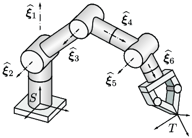

# Robot Kinematics

The main goal of this repository is mathematical calculations of forward and inverse kinematics. This is intended to be used for moving the end effector to a desired coordinate in 2D or 3D space. 

<p align="center"></img></p>

## Getting Started

These instructions will get you a copy of the project up and running on your local machine for development and testing purposes.

### Implementation Example

- A [6-DOF Robot Arm](https://github.com/staytu/robot-arm) researched at **STA Makerspace**.

### Install

```makefile
clone https://github.com/staytu/robot-kinematics
cd robot-kinematics
make SHARED=0
```

## Documentation

Please read the detailed documentation at [Wiki](https://github.com/staytu/robot-kinematics/wiki).

## Contributing

Please read [CONTRIBUTING.md](https://github.com/staytu/.github/blob/master/CONTRIBUTING.md) for details on our code of conduct, and the process for submitting pull requests to us.

## License

This project is licensed under the **GPL-v3** License - see the [LICENSE](https://github.com/staytu/robot-kinematics/blob/master/LICENSE) file for details.